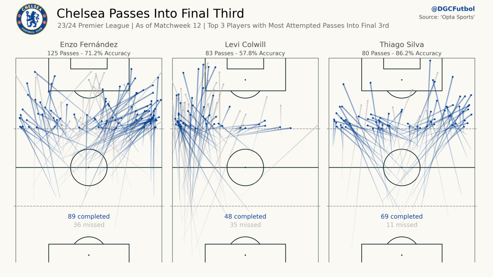
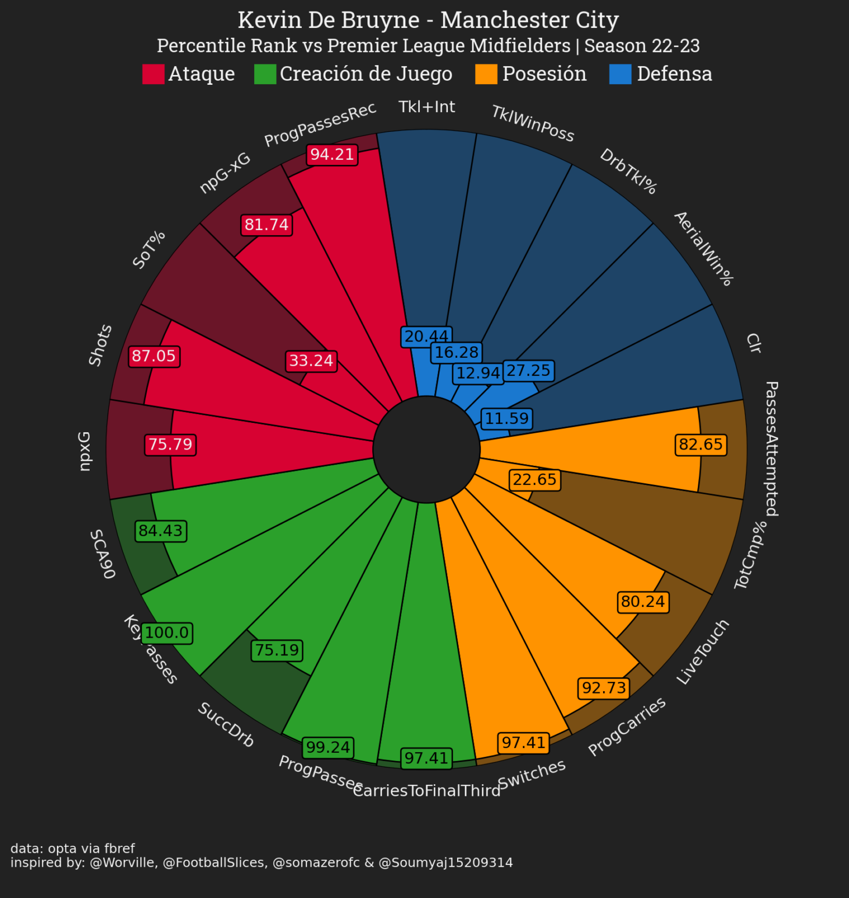
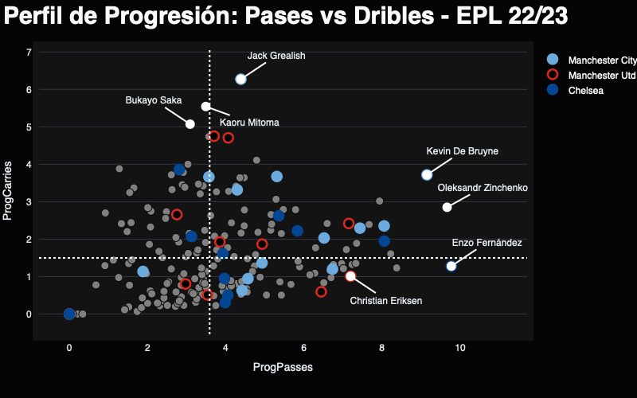

# Daniel Granja C.
### Web App - Analisis y Visualizacion de Datos ⚽

Esta Web App presenta maneras interactivas de visualizar y explorar datos de jugadores y equipos, las cuales ejemplifican su aplicación profesional en Scouting, Análisis de Rendimiento, Análisis Táctico, etc. Se puede acceder a ella mediente este [enlace](dgcfutbol.streamlit.app).

## Creación de Mapas de Pases (Chalkboard)
### Exploración Visual de Rendimiento y Patrones Tácticos

## Pizza Chart
### Calificación Comparativa basada en Rendimiento

## Scatter Plot Interactivo
### Exploración Comparativa de Datos para Identificar Estilos de Juego y Rendimiento

